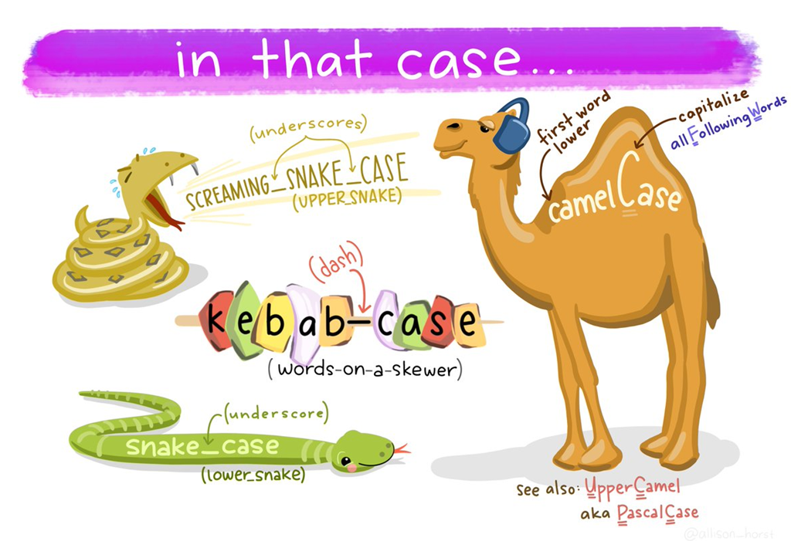

AULA 01 - CALCULADORA DE MÉDIA: VARIÁVEIS & OPERAÇÕES
---

Na primeira aula da Imersão Dev, vamos criar uma calculadora de média e aprender o que são variáveis e como realizar operações! 

## Conteúdo detalhado desta aula

- Criar uma conta no CodePen;
- Entender as diferenças entre HTML, CSS e JavaScript;
- Variáveis, manipulação dos valores armazenados e a memória do computador;
- Tipos de variáveis, como texto e inteiro;
- Fixando a quantidade de casas decimais com a função toFixed().


--- 

### Notas sobre conseitos e observações:

**Variáveis -** como na matemática, são "símbolos" ao qual atribuímos valores, textos e funções. Essas variáveis podem também ser fixas, constantes. Elas alocam espaço na memória do computador para executar as tarefas e cálculos que os programas executam.

Para escrevermos uma variável usamos, em _javascript_, utilizamos a palavra **_var_** seguido do nome da variavel, utilizando um dos diversos métodos de escrita, ou _cases_, seguido de espaço e sinal de igual seguido do "valor" da variavel.
> Existem outras duas formas de declarar variáveis, mais informações no final desta sessão!

_Ex:_
~~~javascript
var nomeDaVariavel = conteudo
~~~
>**Atenção:** _Não confunda Tags com Elementos!_
 Veja mais a respeito neste [link](https://tableless.github.io/iniciantes/manual/html/oquetags.html).
>Por questões de boas práticas de programação utilizamos diferentes métodos para escrever essas variáveis, como o uso de expreções simples e que façam parte do contexto da aplicação e suas funções. utilizamos apenas letras,sem acentos, e números, para escrever uma variável. 

Veremos, a seguir, os principais métodos:

**-** _Camel Case:_ é o padrão mais usado para javascript, uma vez que sua biblioteca é escrita desta forma. Utilizamos a primeira palavra inciando com a letra em minúsculo e as próximas palavras iniciando com letra em maiúsculo, representando as corcovas de um camelo.

_Ex:_
~~~javascript
var camelCase = "Um exemplo de Camel Case."
var outroCamelCase = "Outro exemplo de Camel Case."
~~~
>Uma variação do camelCase é o **Upper Camel**, ou **Pascal Case**, onde a primeira palavra também possui a primeira letra maiúscula ```var UpperCamel = "Um exemplo de Upper Camel/Pascal Case"```.

**-** _Snake Case:_ utilizamos _underline_ entre as palavras e todas os caracteres minúsculos, como uma serpente.

_Ex:_
~~~javascript
var snake_case = "Um exemplo de Snake Case."
var outra_snake_case = "Outro exemplo de Snake Case."
~~~
>Snake Case também é conhecida como **lower Case**.

**-** _Screaming Snake Case:_ também chamada de _Upper Snake_, é o método Snake Case com todos os caracteres maiúsculos.

_Ex:_
~~~javascript
var UPPER_SNAKE_CASE = "Um exemplo de Upper Snake Case."
~~~
**-** _Kebab Case:_ são palavras separadas por hífem, como se fossem legumes e carnes em um espeto, como na preparação de um kebab.

_Ex:_
~~~javascript 
var variavel-em-kebab-case = "Um exemplo de Kebab Case."
~~~


**Observações acerca de _Variáveis_ e _Escopo_ -** quando quando declaramos uma variável, sua execução vai depender, principalmente de sua declaração, uma vez que algumas varáveis seram _constantes_, outras serão sempre executadas, indiferente do escopom, e outras só funcionarão dentro do bloco de código (escopo) que foi declarada. 

**-** _hoisting_: é a "elevação" de uma variável para o escopo global. Sempre que uma variável é declarada como ```var```, indiferente de seu escopo, ela é elevada para o ínio do código. Para especificar o escopo que  uma variável pertence, utilziamos as declarações ```var```, ```let```e ```const```.

**-** _var_: do inglês _variable statement_, ou, _declaração variável_ no Portugês. É declarada por _default_(padrão) como  _undefined_(indefinido), quando não atribuído um valor para ela. Não importa onde está sendo declarada, ela sempre "sofrerá" **hoisting**, portanto, sempre será executada indiferente do escopo.
> [Ver mais](https://developer.mozilla.org/pt-BR/docs/Web/JavaScript/Reference/Statements/var)

Modelos de declaração de variável ```var```.
_Ex:_
~~~javascript
var a = 0;
var b = 0;
~~~

Ou

~~~javascript
var a = 0, b = 0;
~~~

Ou
 ~~~javascript
var a = "A";
var b = a;
~~~

Equivalente a:

~~~javascript
var a, b = a = "A";
~~~

**-** _const_: do inglês _constant_, ou, cosntante no Portugês. Uma vez atribuído um valor à _declaração ```const```_, este valor será fixo, ou seja, cosntante, ela cria uma variável somente leitura, comumemente declarada em caixa alta, e ela não pode ser redeclarada.
> OBS: Constantes globais não se tornam propriedades do objeto ```window```, diferente da criação de variáveis com ```var```.
Uma constante não pode ter o mesmo nome que uma função ou variável que esteja no mesmo escopo.
Existem outras características importantes a serem levadas em considerações, para saber mais basta clicar no link _Veja mais_ logo abaixo.
 [Ver mais](https://developer.mozilla.org/pt-BR/docs/Web/JavaScript/Reference/Statements/const)

**-** _let_: muito provavelemnte, derivado do jargão matemático. Por exemplo, um professor passa um problema e define "let _x_ be our hypotenuse...", "let _x_ be the root of our equation" que em português seria algo como "digamos que o _x_ é nossa hipotenusa", "o _x_ será a raiz da nossa equação" respectivamente. É a forma mais comum de, atualmente, de declarar uma variável dentro de um escopo limitado.
> Existem outras características importantes a serem levadas em considerações, para saber mais basta clicar no link _Veja mais_ logo abaixo.
_DICA_: Leia o trecho sobre [Temporal dead zone (TDZ)](https://developer.mozilla.org/en-US/docs/Web/JavaScript/Reference/Statements/let#temporal_dead_zone_tdz).
[Ver mais](https://developer.mozilla.org/en-US/docs/Web/JavaScript/Reference/Statements/let)

_Ex:_
~~~javascript
var a = 5;
var b = 10;

if (a === 5) {
  let a = 4; // O escopo é dentro do bloco if
  var b = 1; // O escopo é dentro da função

  console.log(a);  // 4
  console.log(b);  // 1
}

console.log(a); // 5
console.log(b); // 1
~~~
> Repare que o escopo da variável ```let a```é dentro do bloco ```if``` e o escopo da variável ```var b``` é dentro da função.

Para mais detalhes, e exemplos, sobre as declarações de variáveis, leia [este artigo](https://www.alura.com.br/artigos/entenda-diferenca-entre-var-let-e-const-no-javascript?gclid=Cj0KCQjw0PWRBhDKARIsAPKHFGitv_vjtF7_DXl-kcb8u6FSk174YZFuQ7YUU-iktcEDwQbSga3H6V4aAsg2EALw_wcB) da Alura sobre o assunto!
> [Neste artigo](https://developer.mozilla.org/pt-BR/docs/Web/JavaScript/Reference/Statements/var) sobre sintaxe podemos encontrar, também, exemplos e definições.


---

**String -** é como chamamos os textos que serão impressos para o usuário. Elas devem ser escritas entre aspas duplas para que os compiladores e interpretadores as entendam como strings.

_EX:_
~~~javascript
var modeloDeString = "Isto é uma string."
var outroExmplo = Isto não é uma string
~~~
>O segundo exemplo desencadearia um erro.

**-** _Concatenação/interpolação:_ concatenação é a conexão entre strings e variáveis em uma impressão. Devemos deixar um espaço entre a ultima palavra da string e a aspas dupla para criar um espaço quando o conteúdo for impresso na tela.

_Ex:_
~~~javascript
var nomeDeUsuario = "Lannyer G. Junior"
document.write("Olá Sr. " + nomeDeUsuario + "!")
~~~
>O resultado desta concatenação seria **Olá Sr. Lannyer G. Junior!**.
>Chamamos de **interpolação** quando alinhamos multiplas variáveis e strings na mesma linha ```document.write("Olá Sr. " + nomeDeUsuario + ", hoje é " + diaDaSemana + ", " + dataDeHoje + "!")```


---

**console.log -** é uma _função_ que imprime um texto no _console_ do compilador/navegador/editor/etc (no caso do JavaScript será possível visualizar através da ferramenta do desenvolvedor do navegador, F12) e que utliza o _método_ ```log()```do _objeto_ ```console```.

_Ex:_
~~~javascript
var nomeDeUsuario = "Lannyer G. Junior"
console.log("Olá Sr. " + nomeDeUsuario + "!")
~~~
>O resultado exibido no console seria **Olá Sr. Lannyer G. Junior!**.
>"**Objeto Console -** O console é efetivamente um objeto com diversos métodos associados. O objeto ```console``` fornece acesso à consola de depuração do navegador. O funcionamento deste objeto varia de navegador para navegador mas existem determinados métodos que são vistos como um standard. Um desses métodos é o ```log()```.
**Método log -** O método ```log()``` existe essencialmente para permitir o envio de dados para a consola de depuração do navegador. Pode ser enviada qualquer informação, normalmente com o intuito de depurar código."
>O Texto a cima foi retirado da questão no [StackOverflow](https://pt.stackoverflow.com/questions/38057/o-que-é-console-log).


---

**Operações matemáticas básicas -** as operações matemáticas básicas são muito simples de serem executadas, tão simples quanto em uma calculadora comum. Para elas utilizamos os mesmos símbolos usados no teclado numérico para usarmos a calculadora padrão do Windows: +, -, / e * . Segue 4 formas de realizar as operações.

_Ex:_
~~~javascript
5+5

var anoAtual = 2022
var anoDeNascimento = 1989
var idadeAtual = anoAtual - anoDeNascimento

var num01 = 15
document.write(num01 * 6)

var notaPrimeiroBimestre = 92.19
var notaSegundoBimestre = 23.72
var notaTerceiroBimestre = 47.43
var notaQuartoBimestre = 71.58
var notaFinal = notaPrimeiroBimestre + notaSegundoBimestre + notaTerceiroBimestre + notaQuartoBimestre
var notaMedia = notaFinal/4
~~~
>Os resultados são, respectivamente: 10 (adição), 32 (subtração), 90 (multiplicação) e 58 (divisão).

---

**toFixed -** utilizamos o _toFixed_ para limitar a quantidade de casas decimais exibidas usando o _método_ ```fixed()``` do _objeto_ ```to```. Primeiro veremos um exemplo com 4 casas decimais e, em seguida, um exemplo com uma casa decimal.

_Ex:_
~~~javascript
var notaPrimeiroBimestre = 92.19
var notaSegundoBimestre = 23.72
var notaTerceiroBimestre = 47.43
var notaQuartoBimestre = 71.58
var notaFinal = notaPrimeiroBimestre + notaSegundoBimestre + notaTerceiroBimestre + notaQuartoBimestre
var notaFinal = notaFinal.toFixed(4)
var notaMedia = notaFinal/4
var notaMedia = notaMedia.toFixed(4)
~~~
>O resultado impresso para variável _notaFinal_ será 234.9200. E o resultado para _notaMedia_ será 58.7300.

_Ex:_
~~~javascript
var notaFinal = notaFinal.toFixed(1)
var notaMedia = notaFinal/4
var notaMedia = notaMedia.toFixed(1)
~~~
>O resultado impresso para variavel _notaFinal_ será 234.9. E o resultado para _notaMedia_ será 58.7.


---

Para saber mais sobre os assuntos tratados nesta aula e para realizar os desafios acesse:

[MDN Web Docs] https://developer.mozilla.org/pt-BR/
[Stack Overflow] https://pt.stackoverflow.com


---

## DESAFIOS

>Os desafios criados pelo Paulo Silveira, pela Rafa Ballerini e pelo Gui Lima, para o projeto desta aula, são bem desafiadores, mesmo que simples. Mesmo que trivíais podem conter, ou não, conteúdos ainda não estutados até o momento da aula, sendo assim, necessário mais pesquisas, estudos, paciência e empenho.

- **Desafio Ballerini:** Alterar design da página.✔️
- **Desafio Paulo:** Realisar calculo direto na impressão. ✔️
- **Desafio Gui:** Realizar calculo de uma forma diferente.✔️
- **Desafio bônus - Ballerini:** Conversor de medidas. ❕

[CodePen - Aula 01: Calculadora de média](https://codepen.io/lannyer/pen/RwLvPJj?editors=0010) | [Repositório no GitHub](https://github.com/Lannyer/imersaodev3/tree/master/Aula1.0-Media) | [Veja a página funcional aqui.](https://lannyer.github.io/imersaodev3/Aula1.0-Media/)